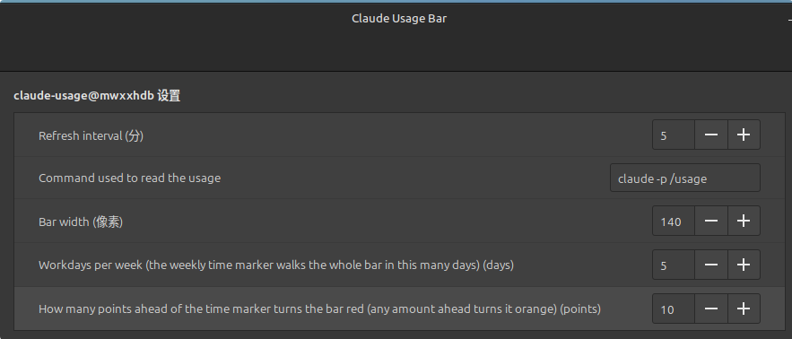

# Claude Usage Bar

[English](README.md) | **简体中文**

一个 Linux Mint（Cinnamon）面板小程序，用两条横向进度条显示你的 Claude Code 用量：

- **上面一条** — 当前 5 小时会话窗口的用量
- **下面一条** — 本周（所有模型）的用量


每条进度条上都有一个白色竖线标记，表示"此刻"处于 5 小时 / 一周窗口中的什么位置，你可以据此判断额度消耗得是否比时间流逝更快：

- **绿色** — 用量落后于标记，节奏安全
- **橙色** — 用量略微超前于标记，可能在重置前用完
- **红色** — 用量远超标记（默认超过 10 个百分点，可配置），大概率会提前用完

数据来自定时运行 `claude -p /usage` 并解析其输出。

## 环境要求

- 使用 **Cinnamon** 桌面的 Linux Mint（在 Mint 22.1 / Cinnamon 6.4 上测试通过）
- 已安装并登录 [Claude Code](https://claude.com/claude-code)，使 `claude -p /usage` 能正常输出用量
- `git`（仅用于克隆本仓库）

安装前先确认数据源可用：

```bash
claude -p /usage
```

输出中应当包含类似 `Current session: 12% used` 和 `Current week (all models): 30% used` 的行。

## 安装

```bash
git clone https://github.com/mwxxhdb/cinnamon-claude-usage-bar.git claude-usage-bar
cd claude-usage-bar
./install.sh
```

然后启用它：**右键面板 → Applets（小程序）→ 找到 "Claude Usage Bar" → 添加到面板。**

`install.sh` 会把小程序以软链接方式装到 `~/.local/share/cinnamon/applets/`，所以请保持克隆下来的目录不动，之后 `git pull` 就能完成更新。可用选项：

| 命令 | 作用 |
|---|---|
| `./install.sh` | 以软链接方式安装（默认） |
| `./install.sh --copy` | 复制文件，之后可以删掉克隆的目录 |
| `./install.sh --uninstall` | 从 `~/.local/share/cinnamon/applets/` 中移除小程序 |

### 手动安装（不使用脚本）

```bash
mkdir -p ~/.local/share/cinnamon/applets
cp -r 'claude-usage@mwxxhdb' ~/.local/share/cinnamon/applets/
```

然后按上面的方式从面板的 Applets 对话框中添加。如果列表里找不到它，重载 Cinnamon：按 **Alt+F2**，输入 `r`，回车。

## 设置

右键小程序 → **Configure**（配置）：



| 设置项 | 默认值 | 说明 |
|---|---|---|
| Refresh interval | 5 分钟 | 每隔多久运行一次 `claude -p /usage` |
| Command used to read the usage | `claude -p /usage` | 如果 `claude` 不在 `PATH` 中，改这里（用绝对路径） |
| Bar width | 140 像素 | 小程序在面板中的宽度 |
| Workdays per week | 5 天 | 每周时间标记走完整条进度条所需的天数（见下文） |
| Danger threshold | 10 个点 | 用量超前标记多少个百分点后，进度条由橙色变为红色 |

### 每周工作日数（Workdays per week）

每周额度始终是 7 天后重置，但如果你一周只工作 5 天，一个在 7 天里匀速移动的标记会让你看起来永远领先于进度。这个设置把窗口切成 N 个 24 小时的片段：标记在窗口开始后的 N×24 小时到达进度条末端，并在本周剩下的时间（也就是你的周末）里停在那里。默认值是 5。

## 使用

- **悬停** — 显示详情提示（百分比、重置时间、上次更新时间）
- **左键点击** — 立即刷新
- 标记位置每分钟更新一次，不必等到下一次刷新

## 说明与故障排查

- 重置时间按本机所在时区解析（`/usage` 输出中的时区名称会被忽略）。
- 每次刷新都会真实执行一次 `claude -p /usage`，所以刷新间隔不要设得太短。
- 命令运行在 **bash 登录 shell**（`/bin/bash -lc`）中，因此 `~/.profile` 或 `~/.bashrc` 里对 `PATH` 的追加会生效。如果进度条一直是空的、提示里显示错误，先在终端里跑同样的命令，或者在设置里填 `claude` 的绝对路径。
- 小程序的加载错误会记录在系统日志中：

  ```bash
  journalctl --user -n 100 | grep -i 'JS ERROR'
  ```

- 改完代码后，用 **Alt+F2 → `r` → 回车** 重载 Cinnamon，或者把小程序从面板移除再重新添加。

## 卸载

```bash
./install.sh --uninstall
```

同时把小程序从面板上移除（右键面板 → Applets），如果需要的话，再删掉它的设置：

```bash
rm -rf ~/.config/cinnamon/spices/claude-usage@mwxxhdb
```
